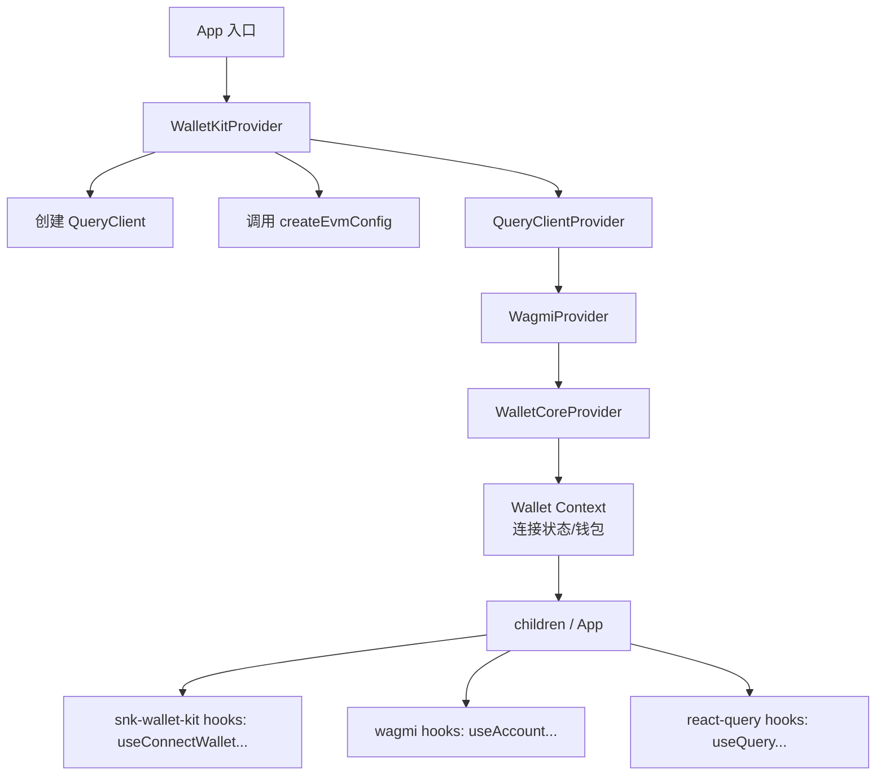
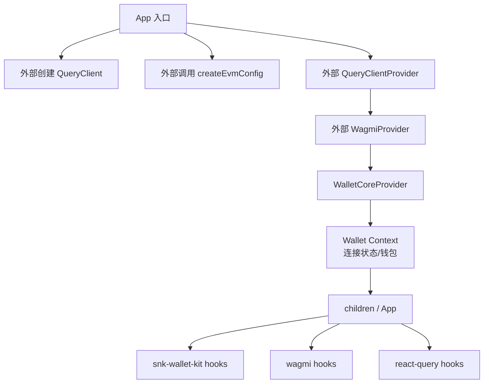

# 2026-05-15 架构重构：暴露 Provider 层级

## 背景问题

当前 `snk-wallet-kit` 的 `WalletProvider` 内部虽然同时包裹了 `QueryClientProvider` 和 `WagmiProvider`，但外部消费方无法通过常规的 wagmi/react-query hooks（如 `useAccount`、`useWriteContract`、`useReadContract`、`useBalance` 等）获取状态，因为这些 Provider 只对 snk-wallet-kit 内部组件可见。

---

## 解决方案：方案 2 - 拆分为两层 Provider

### 核心设计

将原来的单一 `WalletProvider` 拆分为两层 API：

1. **`WalletKitProvider`**：上层开箱即用的 Provider，包含完整的 Provider 层级（保留当前 API 不变）
2. **`WalletCoreProvider`**：底层无状态 Provider，不自己创建 `QueryClientProvider` / `WagmiProvider`，要求外部传入
3. **工具函数**：抽离配置创建逻辑为独立导出
4. **暴露 Hooks**（强烈建议加上）：提供 `useWalletKitConfig`、`useWagmiConfig`、`useQueryClient`

---

## 关键设计要点

### 1. WalletCoreProvider 参数设计

```ts
interface WalletCoreProviderProps {
  config: WalletKitConfig;
  wagmiConfig?: Config;      // 可选，当 evm.enabled = false 时可以不传
  queryClient?: QueryClient; // 可选
  children: React.ReactNode; // 类型检查
}
```

### 2. 最终推荐层级（Context 放置位置很重要）

Wallet 相关的 Context（连接状态、当前钱包等）必须放在 `WalletCoreProvider` 里：

```tsx
<QueryClientProvider>
  <WagmiProvider>
    <WalletCoreProvider>   {/* 这里放 wallet 自己的 Context */}
      {children}
    </WalletCoreProvider>
  </WagmiProvider>
</QueryClientProvider>
```

### 3. 配置创建逻辑分层

```ts
// src/adapters/evm.ts
export function createEvmConfig(config: NormalizedWalletKitConfig): Config | null {
  // 只负责 EVM 配置创建
}

// 未来可扩展
export function createWalletKitConfig(config: WalletKitConfig) {
  // 负责多链合并配置
}
```

### 4. 推荐导出结构

```ts
// 推荐导出
export { WalletKitProvider as WalletProvider } from './WalletKitProvider';
export { WalletCoreProvider } from './WalletCoreProvider';
export { createEvmConfig } from './adapters/evm';
```

### 5. 潜在冲突处理

当用户同时使用多个 wallet kit 时，可能出现多个 Context 实例冲突。建议给内部 Context 加一个唯一 key 或使用 createContext 时做一点防御。

### 6. 其他实用建议

- **增加 `injectProviders` 参数**（可选但强烈推荐）：在 `WalletKitProvider` 上加一个 `injectProviders?: boolean = true`，给极致用户一条逃生通道
- **暴露获取实例的 hooks**（强烈建议加上）
- **版本策略**：这个重构属于 Minor 或 Major？建议发 0.2.0 或 1.0.0，并在 README 里写清楚 Migration Guide
- **多链准备**：现在就可以把 config 设计成真正多链结构（evm + sol + cosmos...），避免后面大改

---

## 实现流程

### 1. 抽离配置创建逻辑

将 `createEvmAdapter` 中创建 wagmi config 的逻辑抽离为独立函数：

```ts
// src/adapters/evm.ts
export function createEvmConfig(config: NormalizedWalletKitConfig): Config | null {
  if (!config.evm.enabled) return null;
  // 原有的 createEvmAdapter 配置创建逻辑
}
```

### 2. 重构 Provider 组件

#### 2.1 新增 `WalletCoreProvider`

- 接受 `config` 为必需参数
- `wagmiConfig` 和 `queryClient` 为可选参数
- 不自己创建 QueryClient / WagmiConfig
- 只负责 wallet 状态管理、样式注入等逻辑
- Wallet 相关 Context 必须放在这里

#### 2.2 重构 `WalletProvider` → `WalletKitProvider`

- 内部创建 queryClient 和调用 createEvmConfig
- 包裹 QueryClientProvider + WagmiProvider
- 内部调用 WalletCoreProvider
- 保留 WalletProvider 作为别名（向后兼容）
- 可选增加 `injectProviders?: boolean = true` 参数

### 3. 更新导出

```ts
// src/react.tsx / src/index.ts
export { WalletProvider, WalletProvider as WalletKitProvider, WalletCoreProvider };
export { createEvmConfig } from "./adapters/evm";

// 新增暴露 hooks
export { useWalletKitConfig, useWagmiConfig, useQueryClient } from "./hooks";
```

---

## 调用流程图

### 上层用法流程图（WalletKitProvider）



### 高级用法流程图（WalletCoreProvider + 自定义 Provider）



---

## 代码示例

### 上层用法（WalletKitProvider）

```tsx
import { WalletProvider } from "snk-wallet-kit";

const config = {
  evm: {
    enabled: true,
    chains: ["mainnet", "sepolia"],
    wallets: ["metaMask", "okxWallet", "walletConnect"],
    walletConnectProjectId: "YOUR_PROJECT_ID",
  },
  sol: {
    enabled: true,
    wallets: ["phantom", "jupiter"],
    cluster: "mainnet-beta",
  },
};

export function Root() {
  return (
    <WalletProvider config={config}>
      <App />
    </WalletProvider>
  );
}
```

### 高级用法（WalletCoreProvider + 自定义 Provider）

```tsx
import { 
  WalletCoreProvider, 
  createEvmConfig, 
  type WalletKitConfig 
} from "snk-wallet-kit";
import { QueryClient, QueryClientProvider } from "@tanstack/react-query";
import { WagmiProvider } from "wagmi";

const walletKitConfig: WalletKitConfig = {
  evm: {
    enabled: true,
    chains: ["mainnet", "sepolia"],
    wallets: ["metaMask", "okxWallet", "walletConnect"],
    walletConnectProjectId: "YOUR_PROJECT_ID",
  },
  sol: {
    enabled: true,
    wallets: ["phantom", "jupiter"],
    cluster: "mainnet-beta",
  },
};

// 外部自己创建的实例
const queryClient = new QueryClient();
const wagmiConfig = createEvmConfig(walletKitConfig);

export function Root() {
  return (
    <QueryClientProvider client={queryClient}>
      <WagmiProvider config={wagmiConfig}>
        <WalletCoreProvider 
          config={walletKitConfig} 
          queryClient={queryClient} 
          wagmiConfig={wagmiConfig}
        >
          <App />
        </WalletCoreProvider>
      </WagmiProvider>
    </QueryClientProvider>
  );
}
```

### 仅 Solana 场景（无需 wagmiConfig）

```tsx
import { 
  WalletCoreProvider, 
  type WalletKitConfig 
} from "snk-wallet-kit";
import { QueryClient, QueryClientProvider } from "@tanstack/react-query";

const walletKitConfig: WalletKitConfig = {
  evm: {
    enabled: false, // 关闭 EVM
  },
  sol: {
    enabled: true,
    wallets: ["phantom", "jupiter"],
    cluster: "mainnet-beta",
  },
};

// 无需创建 wagmiConfig
const queryClient = new QueryClient();

export function Root() {
  return (
    <QueryClientProvider client={queryClient}>
      <WalletCoreProvider 
        config={walletKitConfig} 
        queryClient={queryClient}
        // wagmiConfig 可选，这里不需要传
      >
        <App />
      </WalletCoreProvider>
    </QueryClientProvider>
  );
}
```

---

## 优势总结

1. **简单用法保持不变**：默认 `WalletProvider`（即 `WalletKitProvider`）开箱即用
2. **高级用户完全可控**：`WalletCoreProvider` + 外部 Provider 解决冲突问题
3. **架构清晰**：拆分为两层职责分明
4. **向后兼容**：保留 `WalletProvider` 别名
5. **参数灵活**：`wagmiConfig` 和 `queryClient` 可选，适应不同场景
6. **类型安全**：显式 children 类型检查
7. **扩展性好**：提前为多链做准备
